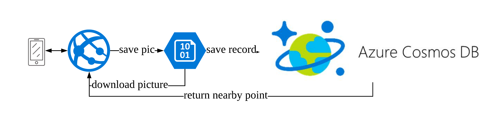
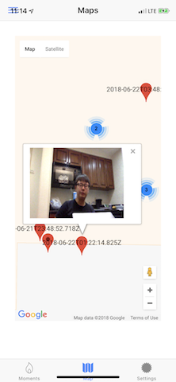
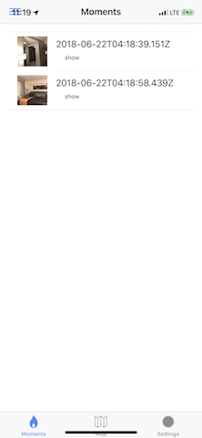
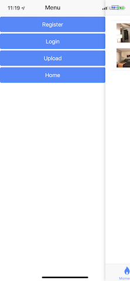

# Cynosure

An Location-based Social Media, only allow user see details of photos when they are close to the place taken that photo. Idea is Facebook Plus Pokemon Go.

Our Project won Walmart Codeception Third Prize in Bentonville.

## System Graph



The whole system is hosted on Azure. The backend is running on WebApp and we used CosmosDB as Database to save metadata. Blob storage is used to save picture and video raw data.


## Backend 

In the BackEnd, I used Undertow as Java Server to serve FrontEnd request. When user upload a picture with GPS, Backend will do the following things:

1. Receive Picture Raw Data, using Java Package to create a ThumberNail file for this image
2. Upload Raw Picture file and Thumbnail to Blob Storage
3. Return URL for both file to FrontEnd
4. FrontEnd post data with time, location and url to Backend
5. BackEnd will save these information as one record in CosmosDB.

### Run


1. Install maven and use `mvn package` to compile code 
2. Run `sudo java -cp target/backend.jar com.walmart.app.backend.MiniSite` to start server


### FrontEnd

The FrontEnd is written with TypeScript in `Ionic`. If you want to run the code, following these instructions.

```bash
sudo npm install -g ionic cordova
ionic cordova platform add browser --save
/Applications/Google\ Chrome.app/Contents/MacOS/Google\ Chrome --disable-web-security --user-data-dir="/tmp"
ionic cordova run browser

```

Please remember to change Google Map API Key in `cynosure/src/index.html`

The frontend will do the following things.

1. Call System camera to take a photo or video.
2. Upload picture to backend.
3. Get user location via GPS.
4. Send information to Backend
5. Retrieve only picture with 50 meters nearby.
6. Show photo and mark them on Google Map.

Some screenshots for our system:




